Art 🎨
******

This section is dedicated to the beauty that emerges when science and art intersect. 🌌🔬  
The images showcased here are not merely data visualizations but also representations 
of the aesthetic possibilities inherent in scientific exploration. 🖼️ Many of these images 
were created during simulations or as part of the process of analyzing complex results. 
Through the application of diverse color scales 🌈 and visualization techniques, they transcend 
their original purpose, revealing patterns, shapes, and contrasts that evoke a sense of wonder. 🌟

Each image tells its own story:

- **Some depict natural phenomena** 🌍—unveiling the intricate, hidden structures of systems 
  modeled through simulations.
- **Others are abstract compositions** 🎭, born from the interplay of mathematical models, 
  computational algorithms, and artistic color mappings.

This collection serves as a reminder that science is not just a pursuit of knowledge 🔎 
but also a source of inspiration and creativity. By sharing these works, I aim to celebrate 
the unexpected beauty that emerges when we look at science through the lens of art. 🌠💡

Art 1
=====
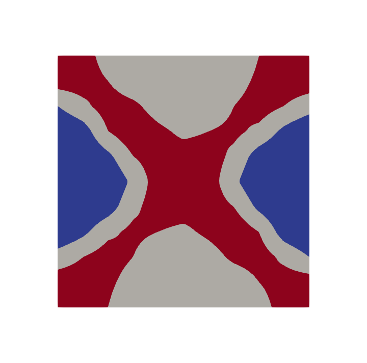

Art 2
=====
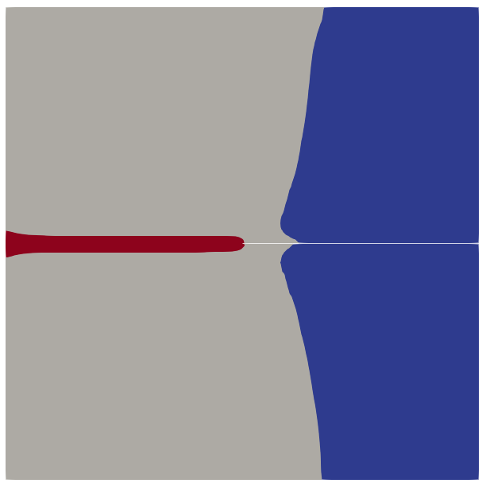

Art 3
=====
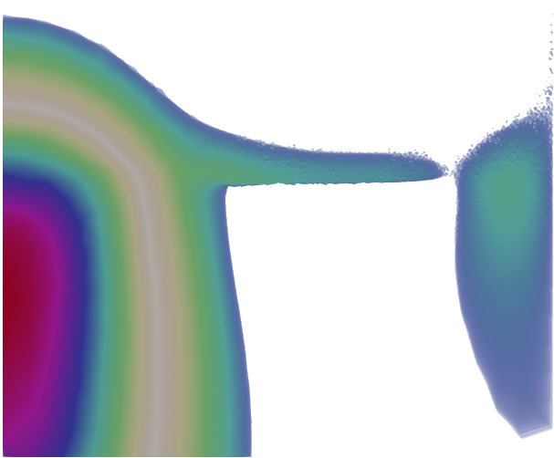

Art 4
=====
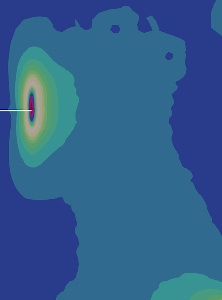

Art 5
=====
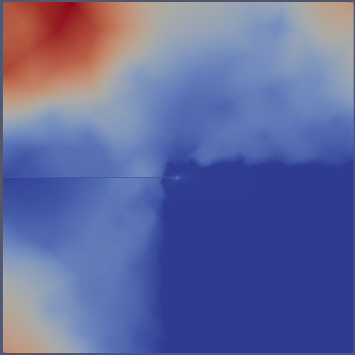

Art 6
=====
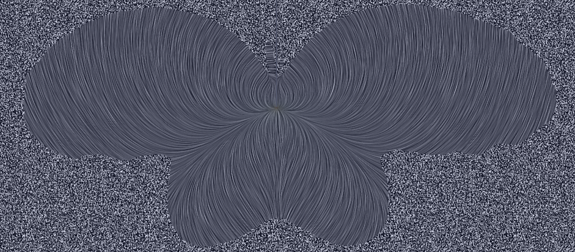

Art 7
=====
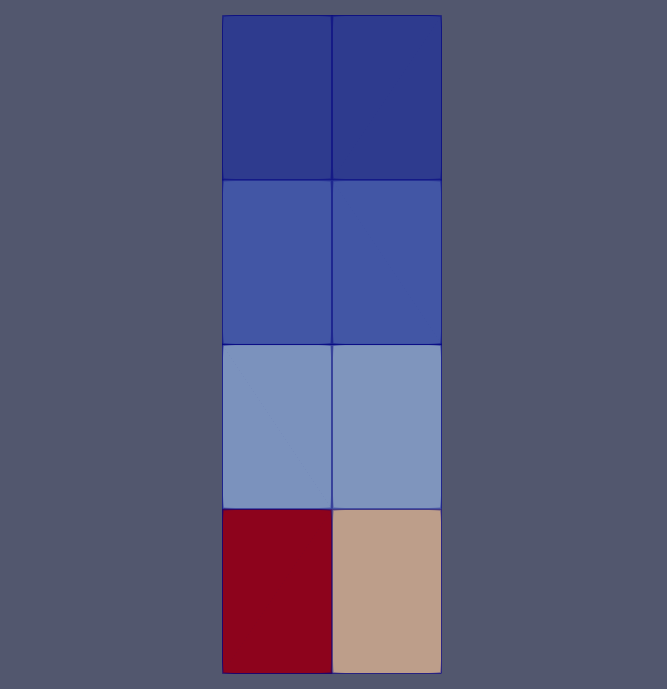

Art 8
=====
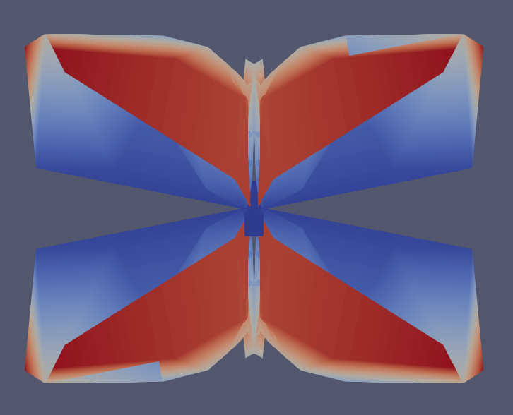

Art 9
=====
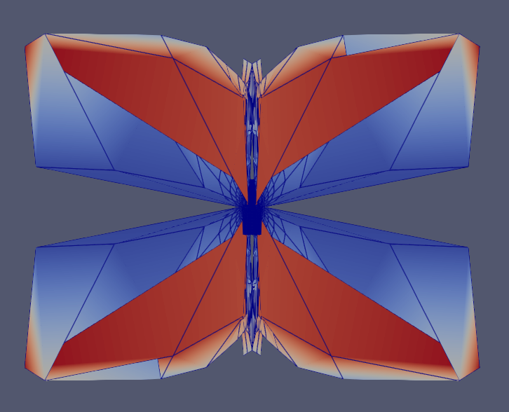

Art 10
======
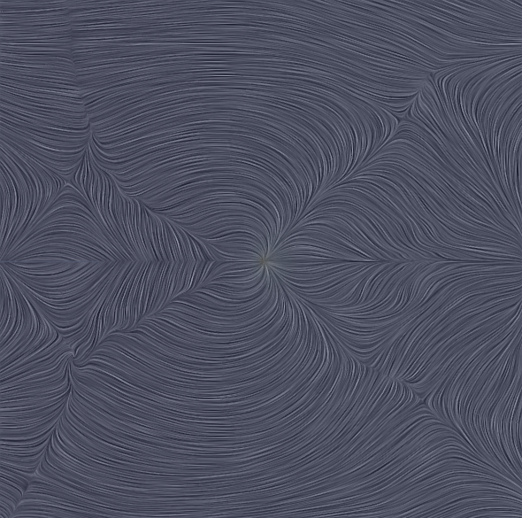

Art 11
======
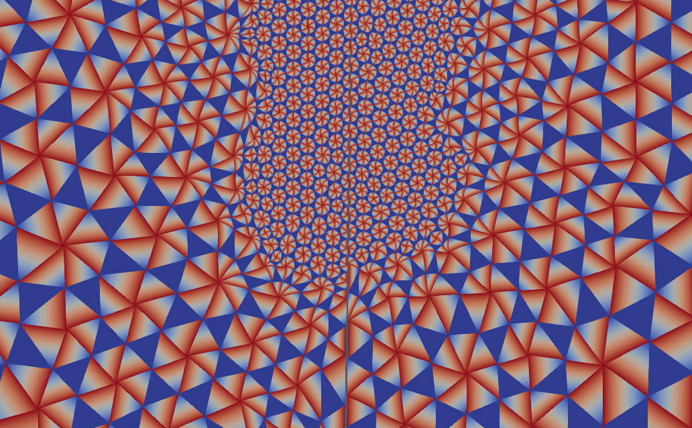

Art 12
======
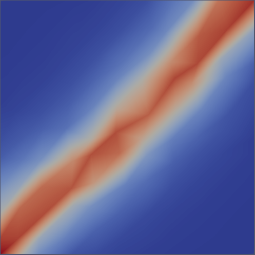

Art 13
======
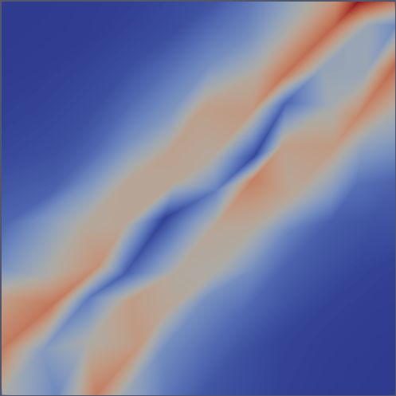

Art 15
======

Art 16
======
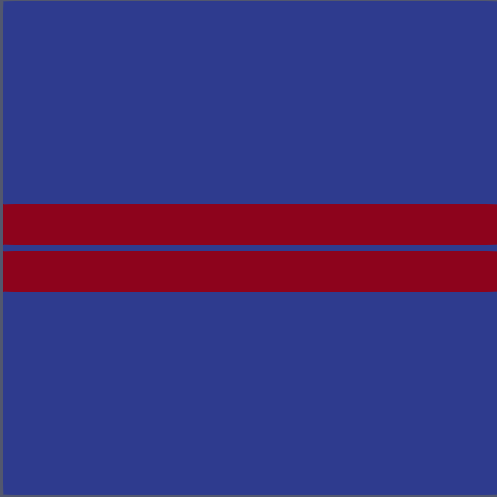

Art 17
======
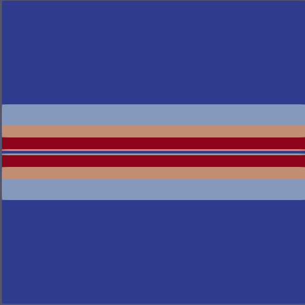

Art 18
======
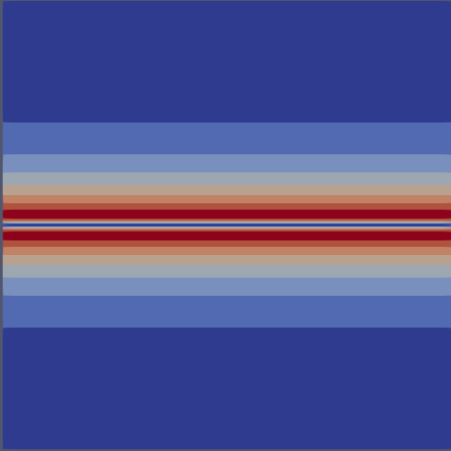

Art 19
======
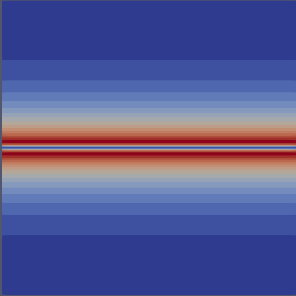

