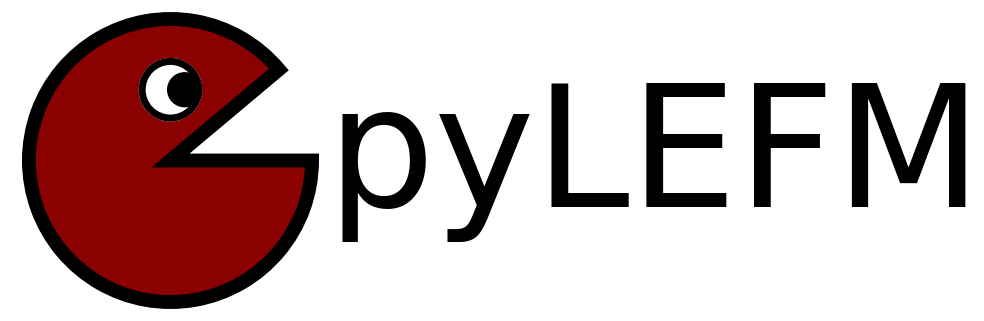

Projects 📦
***********
🎉 Welcome to the **Projects** section, where I present a selection of open-source tools, libraries, and frameworks that I have developed. These projects are crafted to assist researchers, engineers, and developers in addressing complex challenges across various domains, including finite element analysis and scientific computing. 🧑‍💻🔬

This section features some of my key projects:

**PhaseFieldX** ⚙️
-----------------
The **PhaseFieldX** project is designed to simulate and analyze material behavior using phase-field models, which provide a continuous approximation of interfaces, phase boundaries, and discontinuities such as cracks. Leveraging the robust capabilities of **FEniCSx**, a renowned finite element framework for solving partial differential equations, this project facilitates efficient and precise numerical simulations. It supports a wide range of applications, including phase-field fracture, solidification, and other complex material phenomena, making it an invaluable resource for researchers and engineers in **materials science**. 🧪⚙️

For more detailed information, please visit the `PhaseFieldX Documentation <https://phasefieldx.readthedocs.io/en/latest/index.html>`_ and the `GitHub repository <https://github.com/CastillonMiguel/phasefieldx>`_.

.. image:: https://raw.githubusercontent.com/CastillonMiguel/phasefieldx/main/docs/source/_static/logo_name.png
   :target: https://phasefieldx.readthedocs.io/en/latest/index.html
   :alt: PhaseFieldX

**pyLEFM** 📐
-------------
The **pyLEFM** project is a Python library designed for **Linear Elastic Fracture Mechanics (LEFM)** calculations. This tool simplifies fracture mechanics simulations by providing ready-to-use functions and models that enable researchers to study crack propagation and stress intensity factors. Whether you are an academic or a practicing engineer, pyLEFM is a valuable asset for understanding fracture mechanics in structural analysis. 🏗️🔧

.. note::
   **pyLEFM** will be published soon! Stay tuned for its release.

**pyMyCar** 🚗
--------------
The **pyMyCar** project is an open-source Python framework tailored for car dynamics simulations. It allows for real-time analysis of vehicle behavior under different driving conditions. Whether you're working on autonomous vehicle simulations or simply testing car models, **pyMyCar** offers flexibility and precision in handling vehicle dynamics. 🚘💡

For more detailed information, please visit the `pyMyCar Documentation <https://pymycar.readthedocs.io/en/latest/index.html>`_ and the `GitHub repository <https://github.com/CastillonMiguel/pymycar>`_.

.. image:: https://raw.githubusercontent.com/CastillonMiguel/pymycar/main/docs/source/_static/logo.png
   :target: https://pymycar.readthedocs.io/en/latest/index.html
   :alt: pyMyCar
