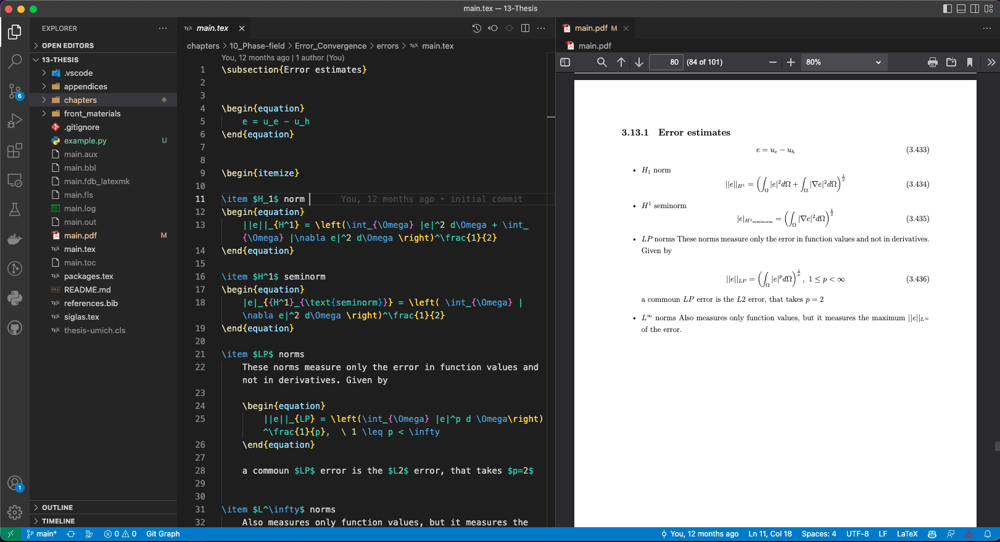

Using LaTeX in Visual Studio Code 📄✍️
=====================================

This guide will help you set up and use LaTeX within Visual Studio Code (VS Code), including the installation of necessary tools and the configuration of your `tasks.json` file for building LaTeX documents with **XeLaTeX**.

  ..  :alt: Latex: visual studio code
  ..  :align: center
  ..  :scale: 50%

Prerequisites 🛠️
----------------

Before working with LaTeX in VS Code, ensure LaTeX is installed on your system:

- **macOS**: Install **MacTeX** via Homebrew:

  .. code-block:: bash

     brew install --cask mactex

- **Windows**: Install **MiKTeX** from `miktex.org <https://miktex.org/download>`__.

- **Linux**: Install **TeX Live** using your package manager:

  .. code-block:: bash

     sudo apt-get install texlive-full

Installing LaTeX Workshop Extension 🔧
--------------------------------------

To get LaTeX working in VS Code, you'll need to install the **LaTeX Workshop** extension:

1. Open VS Code.
2. Go to the Extensions view (`Ctrl+Shift+X`).
3. Search for **LaTeX Workshop** and click **Install**.

This extension provides features like auto-compiling, linting, and PDF viewing.

Configuring `tasks.json` ⚙️
--------------------------

Your `tasks.json` file is already set up to use **XeLaTeX** to compile the document and open the resulting PDF file. Here's a breakdown of the key components:

- **Label**: The task is labeled "xelatex" to indicate it runs XeLaTeX.
- **Command**: Runs `xelatex` on the `main.tex` file.
- **Group**: Defines it as the default build task.
- **Presentation**: Configures how the output is displayed.

Below is an example of your `tasks.json` configuration:

.. code-block:: json

   {
     "version": "2.0.0",
     "tasks": [
       {
         "label": "xelatex",
         "type": "shell",
         "command": "xelatex -interaction=nonstopmode main.tex",
         "group": {
           "kind": "build",
           "isDefault": true
         },
         "presentation": {
           "reveal": "always",
           "panel": "shared"
         }
       },
       {
         "label": "Open pdf",
         "type": "shell",
         "command": "open -a Preview main.pdf",
         "group": {
           "kind": "build",
           "isDefault": true
         },
         "presentation": {
           "reveal": "always",
           "panel": "shared"
         }
       }
     ]
   }

This configuration automatically runs `xelatex` to compile your LaTeX file and opens the PDF using the macOS **Preview** application.

For **Windows** or **Linux**, you can modify the command to open the PDF with the default PDF viewer:

- **Windows**:

  .. code-block:: json

     "command": "start main.pdf"

- **Linux**:

  .. code-block:: json

     "command": "xdg-open main.pdf"

Using the Build Tasks 🛠️
------------------------

Once your `tasks.json` file is set up, you can use the tasks to build your LaTeX documents and open the resulting PDFs.

1. **To build the LaTeX document**: Press `Ctrl+Shift+B` to run the default build task (the `xelatex` task).
2. **To open the PDF**: If configured, the PDF will automatically open using the "Open pdf" task after the document is built.

Customizing LaTeX Workshop 🎨
-----------------------------

To enhance your experience, you can customize LaTeX Workshop settings for compiling with **XeLaTeX**:

1. Open VS Code settings (`Ctrl+,`).
2. Search for `latex-workshop.latex.tools` and add the following configuration to set **XeLaTeX** as the default tool:

   .. code-block:: json

      "latex-workshop.latex.tools": [
          {
              "name": "xelatex",
              "command": "xelatex",
              "args": [
                  "-synctex=1",
                  "-interaction=nonstopmode",
                  "-file-line-error",
                  "%DOC%"
              ]
          }
      ]

Live PDF Preview (Optional) 👀
------------------------------

LaTeX Workshop also provides a live PDF preview feature:

1. Open the command palette (`Ctrl+Shift+P`).
2. Search for `LaTeX Workshop: View PDF` to open the PDF viewer within VS Code.

This allows you to view the compiled PDF directly without needing to open it in a separate viewer.

Summary 📚
----------

By following these steps, you can easily set up LaTeX in Visual Studio Code using the LaTeX Workshop extension and the provided `tasks.json` configuration to compile and view your LaTeX documents. Make sure to adjust the PDF viewer commands depending on your operating system.
